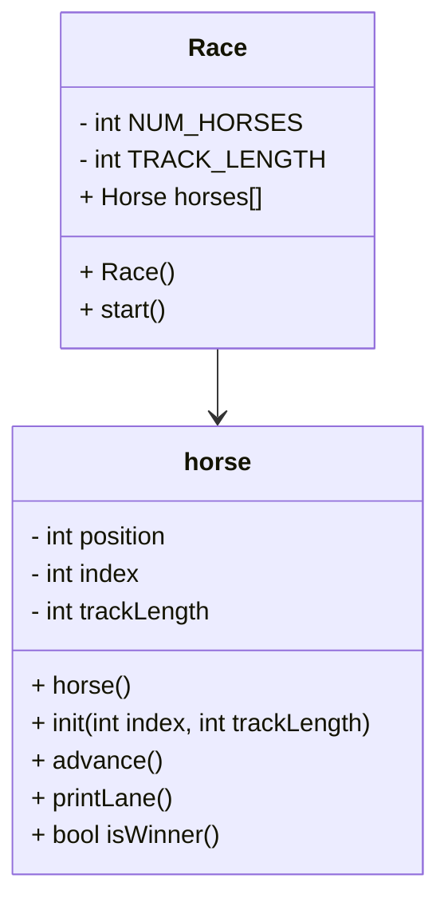

# oop horse race

## UML


## Race::Race()
```
constant int TRACK_LENGTH
constant static int NUM_HORSES
create array of horses length NUM_HORSES
initialize horses
for each horse
    initialize that horse with its index and track length
```

## Race::start()
```
seed random
bool keepGoing
while keepGoing
    go through horses:
        advance the horse
        print the horses lane
        if horse wins
            set keepGoing to false
```

## Horse::Horse()
```
Position = 0
Index = 0
TrackLength = 15
```

## void Horse::init(int index, int TrackLength)
```
horse::index = index
horse::TrackLength = TrackLength
horse::position = 0
```

## void Horse::advance()
```
generate random integer 0-1 named forward
horse::position += forward
```

## void Horse::printLane()
```
for i = 0 to trackLength
    if i == horse number
        print horse number
    else
        print "."
print newline
```

## bool Horse::isWinner()
```
create win = false
if horse::position == trackLength
    win = true
    print a win message
return win
```


